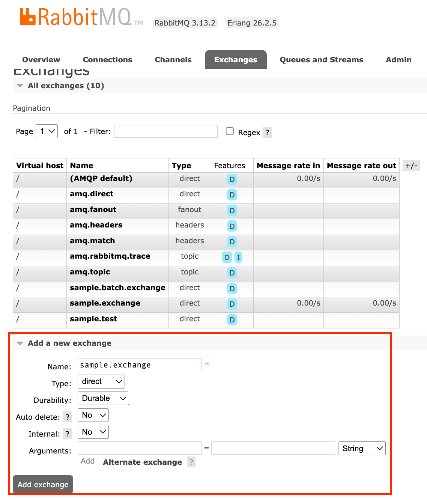
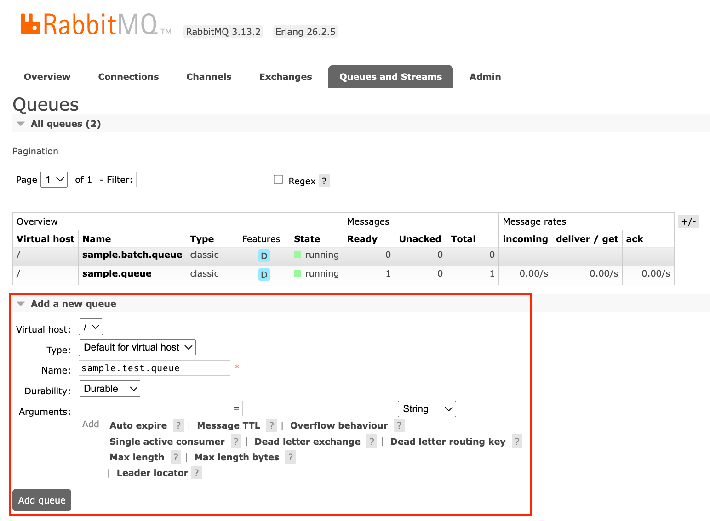
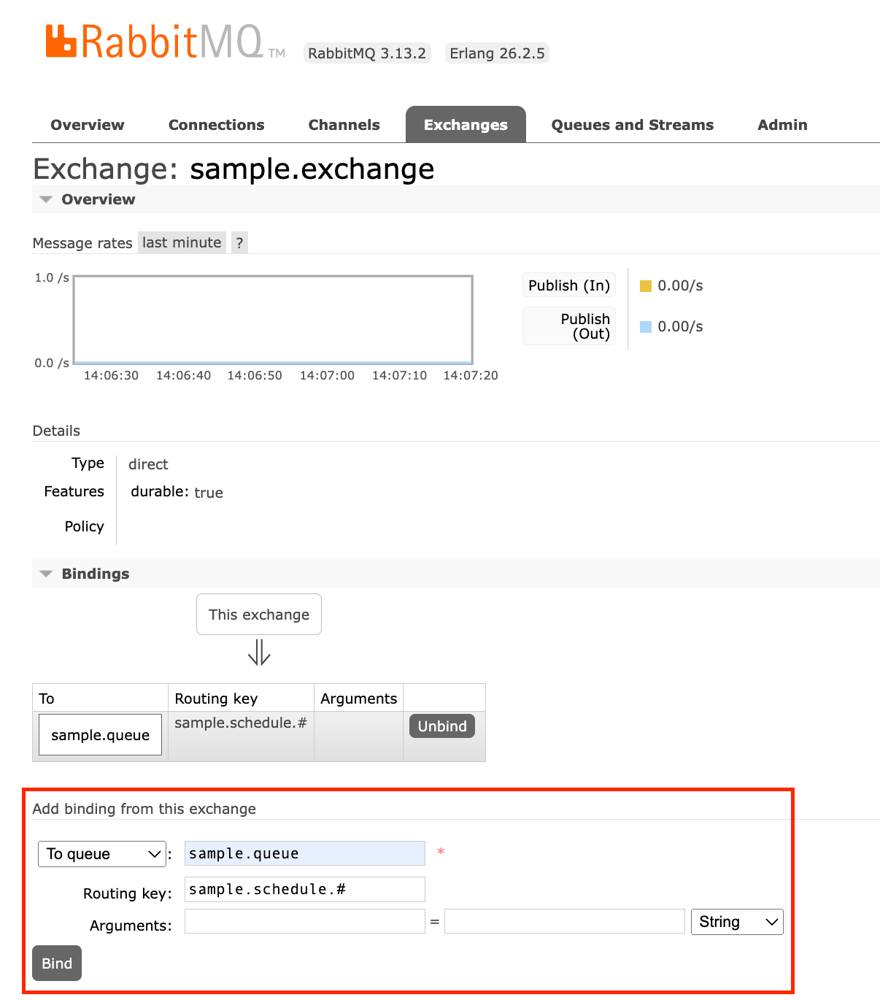
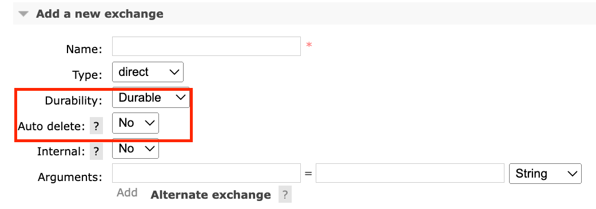
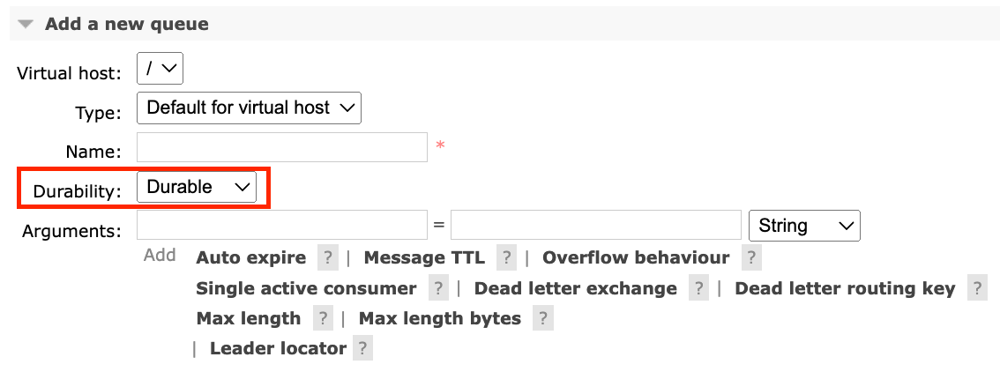
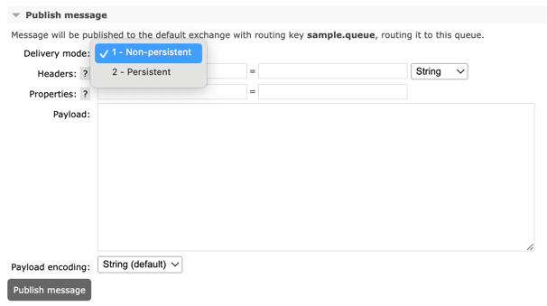
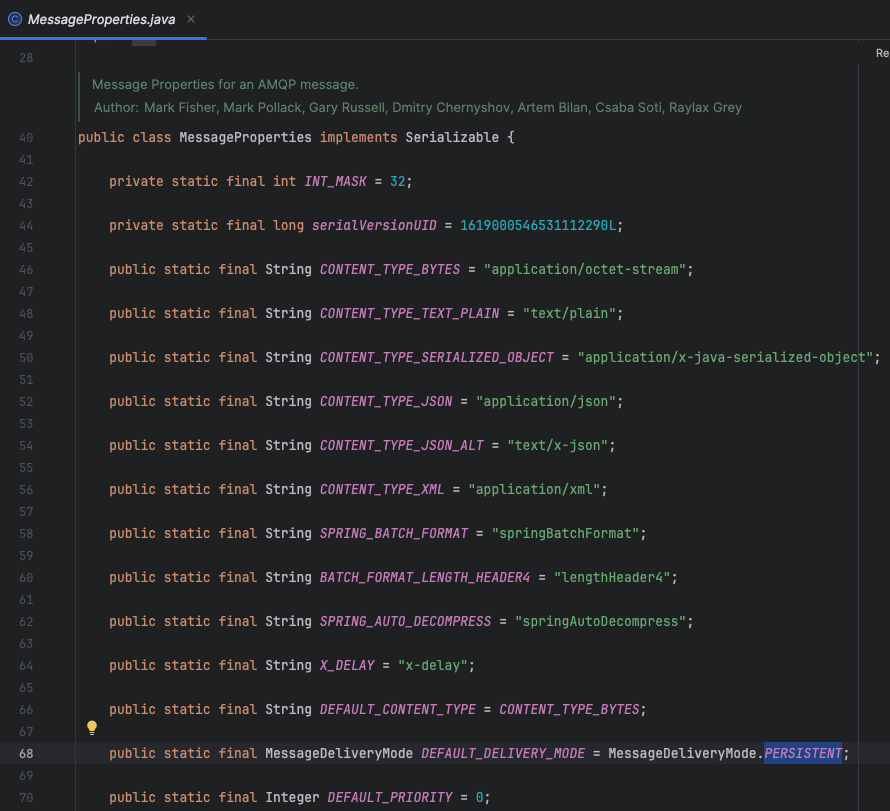

# 개념
- https://velog.io/@sdb016/RabbitMQ-%EA%B8%B0%EC%B4%88-%EA%B0%9C%EB%85%90
- https://jin2rang.tistory.com/entry/RabbitMQ%EB%9E%80

---
# Docker에서 RabbitMQ 실행하기
## 이미지 설치 및 컨테이너 실행
### AMQP, STOMP 모두 사용하는 경우

```bash
$ docker pull rabbitmq:management
$ docker run -d --name webos-rabbitmq -p 5672:5672 -p 15672:15672 -p 15674:15674 --restart=unless-stopped rabbitmq:management
```

- 5672 : AMQP 프로토콜 (기본적으로 RabbitMQ가 사용하는 포트)
- 15672 : RabbitMQ 관리 플러그인 (웹 기반 관리 콘솔을 위한 포트)
- 15674 : STOMP WebSocket 프로토콜 (STOMP를 사용한 메시징을 위한 포트)

### AMQP 사용하는 경우

```bash
$ docker pull rabbitmq:management
$ docker run -d --name webos-rabbitmq -p 5672:5672 -p 15672:15672 -p --restart=unless-stopped rabbitmq:management
```

- 5672 : AMQP 프로토콜 (기본적으로 RabbitMQ가 사용하는 포트)
- 15672 : RabbitMQ 관리 플러그인 (웹 기반 관리 콘솔을 위한 포트)

**AMQP (Advanced Message Queuing Protocol)**
- RabbitMQ에서 기본적으로 사용하는 프로토콜이AMQP 입니다.  이진 프로토콜로서 메시지 브로커와 클라이언트 간의 고성능, 신뢰성 있는 메시징을 지원합니다. AMQP는 RabbitMQ의 주된 메시징 프로토콜로, `5672` 포트를 사용합니다.

### STOMP 사용하는 경우 

```bash
$ docker pull rabbitmq:management
$ docker run -d --name webos-rabbitmq -p 15672:15672 -p 15674:15674 --restart=unless-stopped rabbitmq:management
```

- 15672 : RabbitMQ 관리 플러그인 (웹 기반 관리 콘솔을 위한 포트)
- 15674 : STOMP WebSocket 프로토콜 (STOMP를 사용한 메시징을 위한 포트)

**STOMP (Simple Text Oriented Messaging Protocol)**
- 텍스트 기반의 메시징 프로토콜입니다. 주로 웹 애플리케이션에서 WebSocket을 통해 메시징을 구현할 때 사용합니다. STOMP는 15674 포트를 사용하여 WebSocket 연결을 지원합니다. RabbitMQdptj STOMP를 사용하려면 추가 플러그인을 활성화해야합니다.


1. RabbitMQ 접속

    ```bash
    $ docker exec -it webos-rabbitmq /bin/bash
    ```


1. RabbitMQ plugin 확인

    ```bash
    rabbitmq# rabbitmq-plugins list
    ```


1. RabbitMQ (web)stomp plugin 활성화

    ```bash
    rabbitmq# rabbitmq-plugins enable rabbitmq_web_stomp
    ```

## RabbitMQ 관리 콘솔 브라우저 접속 ([http://ip:15672/](http://localhost:15672/))
- 기본 로그인 계정 : `guest/guest`
    - 따로 설정하지 않아도 RabbitMQ에서 지정한 초기 사용자명과 비밀번호 입니다.

---
# RabbitMQ 관리 콘솔 브라우저 사전작업

- RabbitMQ Management 페이지에서 `Exchange`와 `Queue`를 생성 후, Exchange 메뉴 > Bindings 에서 To queue 매핑하고, `Routing key`를 생성 후 바인딩 해줍니다.

1.



2. 


3.


---
# Spring Boot 설정
- Spring Boot 애플리케이션의 `application.yml` 또는 `application.properties` 파일에 다음과 같은 설정을 추가합니다.

```yaml
spring:
  rabbitmq:
    host: localhost
    port: 5672
    username: guest
    password: guest
```

- 자동 연동
    - 위와 같이 설정을 추가하면 Spring Boot의 RabbitMQ 자동 구성(auto-configuration)이 이 정보를 사용하여 RabbitMQ와 연결을 시도합니다. Spring Boot는 Spring AMQP를 통해 RabbitMQ와 통신하며, `RabbitTemplate`, AmqpAdmin 등과 같은 기본적인 Bean을 자동으로 생성합니다.

- Spring Boot 애플리케이션 로그 확인
    - 애플리케이션 실행한 후 로그를 통해 RabbitMQ와의 연결이 성공했는지 확인합니다. 정상적으로 연결되면 관련 로그 메시지가 출력됩니다.

    ```bash
    2024-05-16 10:45:19.080  INFO [      main] org.springframework.amqp.rabbit.connection.CachingConnectionFactory:666 : Attempting to connect to: [localhost:5672]
    2024-05-16 10:45:19.084 DEBUG [      main] com.rabbitmq.client.impl.ConsumerWorkService:40 : Creating executor service with 8 thread(s) for consumer work service
    2024-05-16 10:45:19.107  INFO [      main] org.springframework.amqp.rabbit.connection.CachingConnectionFactory:608 : Created new connection: rabbitConnectionFactory#3661b732:0/SimpleConnection@3539cf45 [delegate=amqp://guest@127.0.0.1:5672/, localPort=60323]
    2024-05-16 10:45:19.109 DEBUG [      main] org.springframework.retry.support.RetryTemplate:330 : Retry: count=0
    2024-05-16 10:45:19.109 DEBUG [      main] org.springframework.amqp.rabbit.core.RabbitAdmin:658 : Initializing declarations
    2024-05-16 10:45:19.109 DEBUG [      main] org.springframework.beans.factory.support.DefaultListableBeanFactory:225 : Creating shared instance of singleton bean 'jpaMappingContext'
    2024-05-16 10:45:19.116 DEBUG [      main] org.springframework.amqp.rabbit.core.RabbitAdmin:696 : Nothing to declare
    2024-05-16 10:45:19.120 DEBUG [org.springframework.amqp.rabbit.RabbitListenerEndpointContainer#0-1] org.springframework.amqp.rabbit.listener.BlockingQueueConsumer:620 : Starting consumer Consumer@333efb51: tags=[[]], channel=null, acknowledgeMode=AUTO local queue size=0
    ```

    - 위와 같이 로그가 나오면 Spring Boot 애플리케이션은 RabbitMQ와 자동으로 연동됩니다. 만약 연결에 문제가 있다면, 로그를 통해 원인을 확인하고 설정을 점검해야 합니다.


---
# Consumer 테스트
- Topic Exchange 타입으로 구현함.


# Producer 테스트

- Config
    - 사전작업에서 정한 exchange, queue, routing 등의 정보를 토대로 bean을 생성한다.

- Controller
    - 메시지 발행해주는 역할
    - rabbitTemplate 이용해서 메시지를 보낸다.


# Batch Consumer 테스트
https://docs.spring.io/spring-amqp/reference/amqp/receiving-messages/batch.html


---
# 메시지 손실 방지
## RabbitMQ 서버가 재시작 되었을 때 메시지 손실 방지
- Exchange/Queue 구성 옵션
  - Exchange/Queue 구성은 기본적으로 메모리에 저장됩니다. 따라서 RabbitMQ 서버를 재시작하게 되면 메모리가 초기화 되기 때문에 Exchange/Queue 구성 역시 사라지게 됩니다.
  - Exchange/Queue를 영굿적으로 하기 위해선 Durability 옵션을 true, Auto delete 옵션을 false로 설정하면 메모리가 아닌 디스크에 저장되기 때문에 RabbitMQ를 재시작하더라도 사라지지 않습니다.
  - 다행히 SpringBoot AMQP와 RabbitMQ management 둘 다 `Durability = true, Auto delete = false` 해당 값들은 기본 값으로 설정되어 있습니다. 

    
    
  
- Publish 구성 옵션
  - 메시지를 발행할 때 `Delivery mode`가 2인지 확인
    - 1 : 메모리 저장 (손실 발생)
    - 2 : 디스크 저장 (손실 없음)
    - RabbitMQ management는 기본 mode가 1 입니다. management ui 상에서 간단하게 테스트 하는 경우는 기본 mode로 해도 무방할 것 같습니다.
    

  - SpringBoot AMQP에서 메시지 publish할 때 Delivery mode는 기본적으로 `Persistent`로 설정되어 있습니다. 이는 메시지가 RabbitMQ 서버의 재시작 후에도 지속되도록 보장합니다.
    - 'RabbitTemplate' 클래스 내부적으로 setMessageConverter() > MessageConverter.java >  toMessage() > MessageProperties 클래스에서 Delivery mod를 Persistent로 설정하는 것을 확인할 수 있습니다.
      


## Consumer Listener ACK Mode
- 자동 ACK
  - 메시지 전달 : spring-boot-starter-amqp의 기본설정으로 메시지를 소비자에게 전달된 직후, RabbitMQ는 자동으로 ACK을 보냅니다.
  - 메시지 처리/예외 발생 : 소비자가 메시지를 처리하기 전 또는 처리 중에 에러가 발생해도 이미 ACK을 전송했기 때문에 RabbitMQ는 해당 메시지를 큐에서 제거합니다. 
  - 결과 : 소비자가 처리 중인 메시지에서 예외가 발생하면 메시지가 유실됩니다.

- 수동 ACK
  - 메시지 전달 : 메시지가 소비자에게 전달합니다.
  - 메시지 처리/예외 발생 : 소비자가 메시지 처리를 완료하면 'basicAck'를 날려 수동 ACK 처리하고, 소비자가 메시지 처리 중에 예외가 발생하면 소비자는 'basicAck()' 호출하지 않고 'basicNack()' 호출하거나 아무것도 호출하지 않습니다.
  - 결과 : RabbitMQ는 ACK을 받지 못했기 때문에, 해당 메시지를 다시 큐에 넣고 소비자에게 재전송합니다. 
    - 다시 원래 큐로 돌아가기 때문에 재처리 해야할 메시지와 신규 메시지가 혼합되면서 처리 효율성이 떨어질 수도 있고, 계속 재전송 받는 경우 무한 루프 문제가 발생할 수 있어 디스크 공간을 소모할 수 있습니다. 

- 정리
  - 자동/수동 ACK 문제 해결의 이상적인 방법은 수동 ACK 설정하고 소비자가 메시지 처리 중 '에러발생' 시 재처리 메시지와 신규 메시지를 분리하여 메시지 처리 효율성을 높힙니다.
  - 재처리 메시지는 DLX(Dead Letter Exchange)/DLQ(Dead Letter Queue)를 구성하여 예외가 발생한 메시지는 다른 대기 열에 별도로 처리할 수 있게 보상 처리 합니다.
